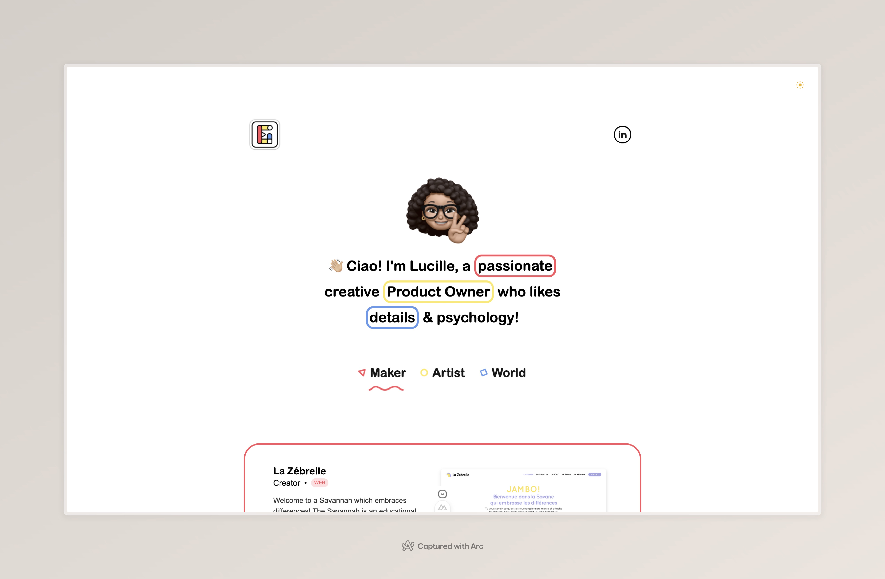

  

An awesome website portfolio 🌟

  

## Table of Contents

- [Table of Contents](#table-of-contents)
- [👀 Overview](#-overview)
- [License](#license)
- [Hire me](#hire-me)
- [Credits](#credits)

## 👀 Overview

This is a personal [website](https://nuxt.com) and portfolio made with [Nuxt](https://nuxt.com) and [Firebase](https://firebase.google.com/).

## License

MIT License.

Feel free to clone this project for your own benefits as long as you generate your own content.

## Hire me

I live in France and I currently take freelance work.

## Credits

* [Nuxt UI docs](https://ui.nuxt.com)
* [Nuxt docs](https://nuxt.com/docs/getting-started/introduction)
* [Light Switch Turn Off Sound](https://freesound.org/people/ChrisTutorials/sounds/440499/) by [ChrisTutorials](https://freesound.org/people/ChrisTutorials/)
* [Switch Light 02.wav](https://freesound.org/people/tbrook/sounds/348221/) by [tbrook](https://freesound.org/people/tbrook/)
